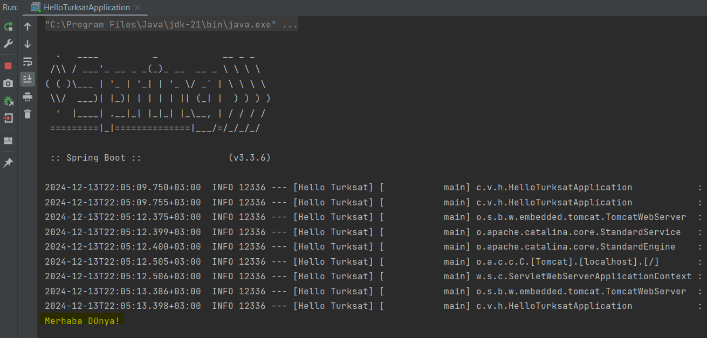
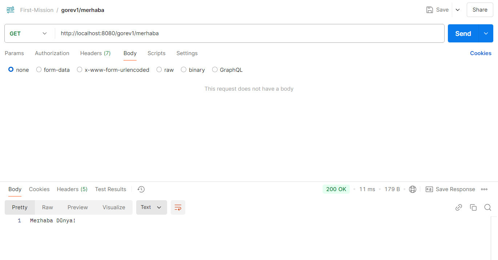
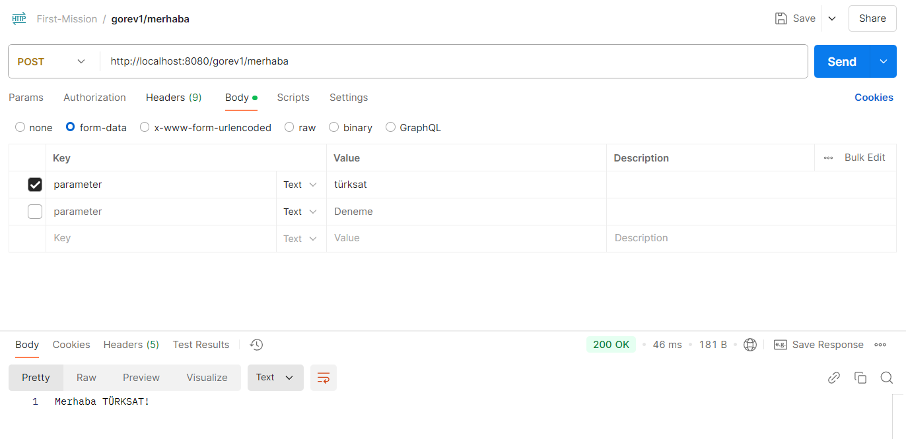
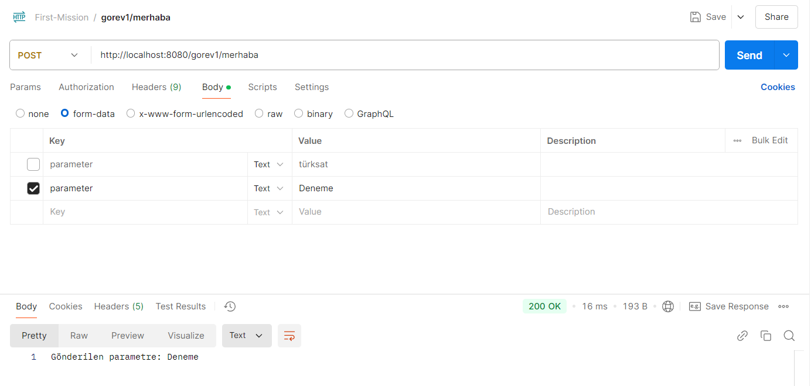
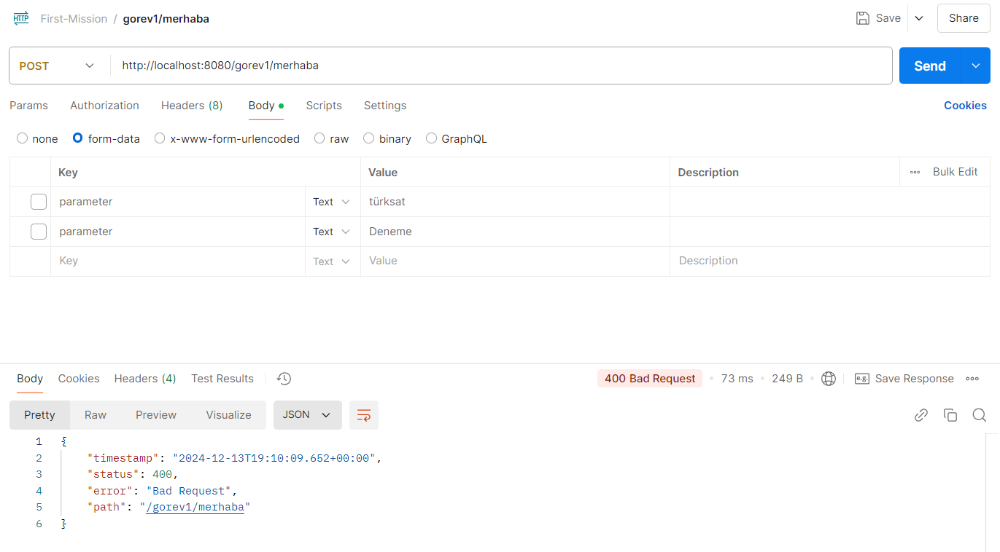
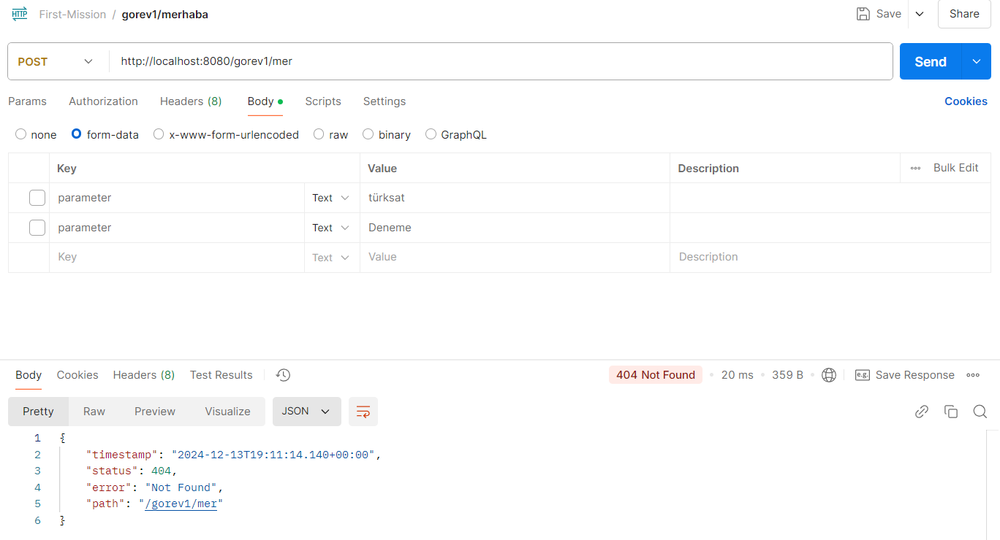
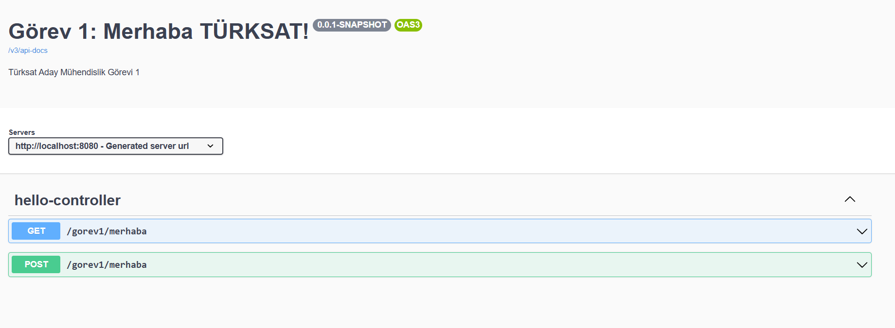
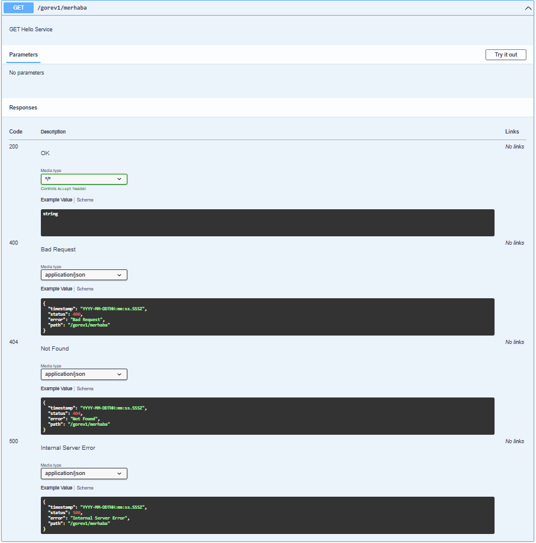
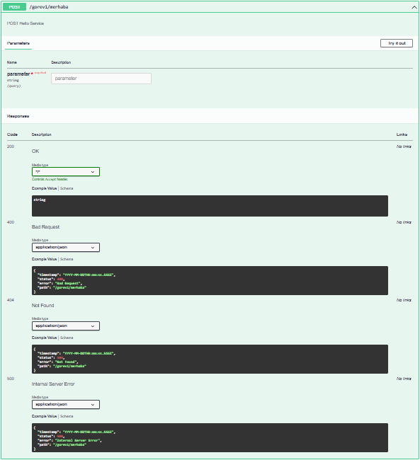
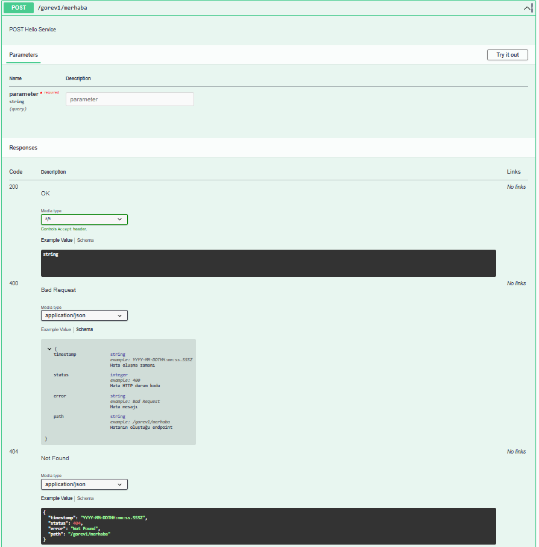

# Merhaba Türksat! 

### Görev 1:
- [x] Uygulama konsola "Merhaba Dünya!" çıktısını basacak şekilde çalıştırılacak.
- [x] Uygulama Rest Servis olarak dönüştürülecek. 
- [x] İki tane metodunuz olacak biri GET diğeri POST. İsimlendirmelerini size bırakıyorum. Rest servis metod isimlendirme standartlarını gözden geçirebilirsiniz.
- [x] GET metoduna istek atıldığında servis sonucu "Merhaba Dünya!" olacak.
- [x] POST metodu bir parametre alacak. Aldığı parametreyi servis sonucuna yazacak. Parametre TÜRKSAT ise servis sonucu "Merhaba TÜRKSAT!" olacak.
- [x] Postman uygulaması kurulup çalışıtırılacak. Yazdığınız metodlara postman üzerinden istek atılacak. Servis sonuçları görülecek.
- [x] Swagger kullanılarak yazdığınız Rest API nin görselleştirmesi yapılacak. (Swagger'da görüntülenen HTTP Durum kodları farklı senaryolar ile deneyerek Postman'dan gelen veriye göre oluşturuldu)
-  

Projenin OpenAPI Swagger Dökümanı:
http://localhost:8080/swagger-ui/index.html

## Uygulama Görüntüleri

### Konsol Görüntüsü

### Postman Görüntüleri
#### Get Request gorev1/merhaba

#### Post Request gorev1/merhaba
- parameter = türksat

- parameter = Deneme

#### HTTP Kodları

- 400 Bad Request

- 404 Not Found

- 500 Internal Server Error

### Swagger Görüntüleri
#### API Description

#### GET Endpoint

#### POST Endpoint

