# Merhaba Türksat!

<hr/>

Projenin OpenAPI Swagger Dökümanı: http://localhost:8080/swagger-ui/index.html

<hr/>

# Görev 1 : Hello Türksat 

<details>
<summary><h3 style="display: inline-block">Detayları Görüntüle</h3></summary>

## Yapılacaklar:
- [x] Uygulama konsola "Merhaba Dünya!" çıktısını basacak şekilde çalıştırılacak.
- [x] Uygulama Rest Servis olarak dönüştürülecek.
- [x] İki tane metodunuz olacak biri GET diğeri POST. İsimlendirmelerini size bırakıyorum. Rest servis metod isimlendirme standartlarını gözden geçirebilirsiniz.
- [x] GET metoduna istek atıldığında servis sonucu "Merhaba Dünya!" olacak.
- [x] POST metodu bir parametre alacak. Aldığı parametreyi servis sonucuna yazacak. Parametre TÜRKSAT ise servis sonucu "Merhaba TÜRKSAT!" olacak.
- [x] Postman uygulaması kurulup çalışıtırılacak. Yazdığınız metodlara postman üzerinden istek atılacak. Servis sonuçları görülecek.
- [x] Swagger kullanılarak yazdığınız Rest API nin görselleştirmesi yapılacak. (Swagger'da görüntülenen HTTP Durum kodları farklı senaryolar ile deneyerek Postman'dan gelen veriye göre oluşturuldu)
  <br/><hr/>

## Dökümantasyon

### REST API Nedir?


Rest API, internet üzerinden bir sistemin diğer bir sisteme veri göndermesini ya da almasını sağlayan bir yapı. **REST** (Representational State Transfer) protokolüne dayanır. Bu yapı, istemci (client) ve sunucu (server) arasında veri alışverişi yaparken HTTP yöntemlerini (GET, POST, PUT, DELETE gibi) kullanır.

**Nasıl çalışır?**
1. **İstemci** (mesela bir web uygulaması ya da mobil app) bir **istek** (request) gönderir.
2. **Sunucu** gelen isteğe göre bir **yanıt** (response) döner.
3. Veri genellikle **JSON** ya da **XML** formatında gönderilir.

**Nerelerde kullanılır?**
- Web uygulamalarında, mobil uygulamalarda, dış servislerle iletişimde yani kısacası, farklı sistemlerin birbiriyle konuşması gereken her yerde kullanılır.

### Spring Boot


Spring Boot, Java programlama dilinde yazılmış bir framework'tür. Spring çatısının üzerine kuruludur ve hızlı bir şekilde web uygulamaları ve mikro servisler geliştirmeyi sağlar.

### Controller

#### `HelloControllerImpl` Sınıfı

Bu sınıf, Spring Boot uygulamasında HTTP isteklerine yanıt veren bir REST controller'dır. IHelloController arayüzünü implement eder ve 3 temel endpoint sunar: biri GET, ikisi ise POST isteği kabul eder.

#### Anotasyonlar:
- **@RestController**: Bu sınıf, RESTful servis olarak çalıştığı için bu anotasyon kullanılır. Yani bu sınıf, HTTP isteklerine cevap verir.
- **@RequestMapping("api/gorev1")**: Bu anotasyon, tüm sınıfın istek yolunu tanımlar. Sınıf içerisindeki her metodun başına bu yol eklenir. Yani, istekler için bir base url görevi görür. İsteklerin "api/gorev1" yolundan yapılması gerektiğini belirtir.
- **@GetMapping(/merhaba)**: /api/gorev1/merhaba altına gelen GET isteklerini karşılar
- **@PostMapping(/merhaba)**: /api/gorev1/merhaba altına gelen POST isteklerini karşılar
- **@PostMapping(/json-merhaba)**: /api/gorev1/merhaba altına gelen POST ve RequestBody ile JSON olarak gönderilen istekleri karşılar

#### Metodlar:
1. **GET /merhaba**
  - "Merhaba Dünya!" mesajını döndürür.
   ```java
   @GetMapping("/merhaba")
   public String getHello() {
       return "Merhaba Dünya!";
   }
   ```

2. **POST /merhaba** (Parametreli)
  - Parametre alır ve "TÜRKSAT" mesajı dışında gönderilen parametreyi döndürür.
   ```java
   @PostMapping("/merhaba")
   public String sayHello(@RequestParam(required = false) String parameter) {
       if (parameter == null || parameter.isEmpty()){
           throw new BaseException(new ErrorMessage(MessageType.FIELD_REQUIRED,null));
       }
       if("TÜRKSAT".equalsIgnoreCase(parameter.trim())){
           return "Merhaba TÜRKSAT!";
       }
       return "Gönderilen parametre: " + parameter.trim();
   }
   ```

3. **POST /json-merhaba** (JSON Parametreli)
  - JSON formatında gelen veriyi alır ve "TÜRKSAT" mesajına göre yanıt verir.
   ```java
   @PostMapping("/json-merhaba")
   public String sayHello(@RequestBody DtoHello parameter) {
       if (parameter == null || parameter.getMessage().isEmpty()){
           throw new BaseException(new ErrorMessage(MessageType.FIELD_REQUIRED,null));
       }
       if("TÜRKSAT".equalsIgnoreCase(parameter.getMessage().trim())){
           return "Merhaba TÜRKSAT!";
       }
       return "Gönderilen parametre: " + parameter.getMessage().trim();
   }
   ```
---

#### `OpenAPIConfig` Sınıfı

Bu sınıf, Swagger/OpenAPI yapılandırmasını sağlar ve API yanıtlarının dökümantasyonunu oluşturur.

#### Anotasyonlar:
- **@Configuration**: Spring’e bu sınıfın bir yapılandırma sınıfı olduğunu belirtir.
- **@OpenAPIDefinition**: OpenAPI tanımının kullanılacağını belirten anotasyon.

#### Yapılandırmalar:
1. **ApiResponse Tanımlamaları**:
  - **badRequest**: 400 hatası için açıklama ve JSON formatında yanıt şeması tanımlar.
  - **notFound**: 404 hatası için açıklama ve JSON formatında yanıt şeması tanımlar.
  - **internalServerError**: 500 hatası için açıklama ve JSON formatında yanıt şeması tanımlar.

2. **`@Bean` customOpenAPI Metodu**:
  - **Components**: Tanımlanan yanıtlar (badRequest, notFound, internalServerError) OpenAPI component’ine eklenir.
  - **API Bilgisi**: API başlığı, versiyonu ve açıklaması gibi bilgiler Swagger/OpenAPI dokümantasyonuna eklenir.

   ```java
   return new OpenAPI().components(components).info(
           new Info()
                   .title("Görev 1: Merhaba TÜRKSAT!")
                   .version("0.0.1-SNAPSHOT")
                   .description("Türksat Aday Mühendislik Görevi 1")
   );
   ```

Yani bu sınıf, Swagger için hata yanıtlarını (400, 404, 500) ve API’nin genel bilgilerini dökümante eder.

#### `ApiResponseSchema` Sınıfı

Bu sınıf, özel bir API yanıtı şeması oluşturmak için kullanılır. Swagger/OpenAPI dökümantasyonunda hata yanıtlarının yapısını tanımlar.

#### Metodlar:
1. **`getCustomResponseSchema` Metodu**:
  - Bu metod, hata yanıtları için özel bir `Schema` nesnesi oluşturur.
  - **Parametreler**:
    - **timestampExample**: Hata oluşma zamanının örneği.
    - **statusExample**: Hata durum kodunun örneği (örneğin, 400, 404).
    - **errorExample**: Hata mesajının örneği.
    - **pathExample**: Hatanın oluştuğu endpoint yolunun örneği.

  - Metod, `timestamp`, `status`, `error`, ve `path` gibi alanlarla yapılandırılmış bir `Schema` döner. Bu alanlar, Swagger/OpenAPI dokümantasyonunda hata yanıtları için açıklama ve örnekler sunar.

   ```java
   public static Schema<Object> getCustomResponseSchema(String timestampExample, int statusExample, String errorExample, String pathExample) {
       return new Schema<>()
               .addProperty("timestamp", new Schema<String>().type("string").description("Hata oluşma zamanı").example(timestampExample))
               .addProperty("status", new Schema<Integer>().type("integer").description("Hata HTTP durum kodu").example(statusExample))
               .addProperty("error", new Schema<String>().type("string").description("Hata mesajı").example(errorExample))
               .addProperty("path", new Schema<String>().type("string").description("Hatanın oluştuğu endpoint").example(pathExample));
   }
   ```


## Uygulama Görüntüleri

### Konsol Görüntüsü

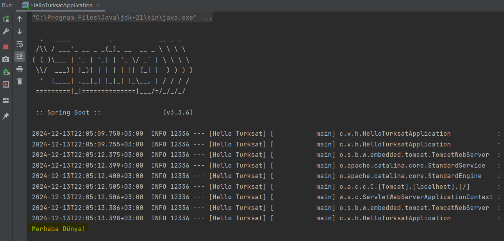

<hr/>

### Postman Görüntüleri
#### Get Request gorev1/merhaba

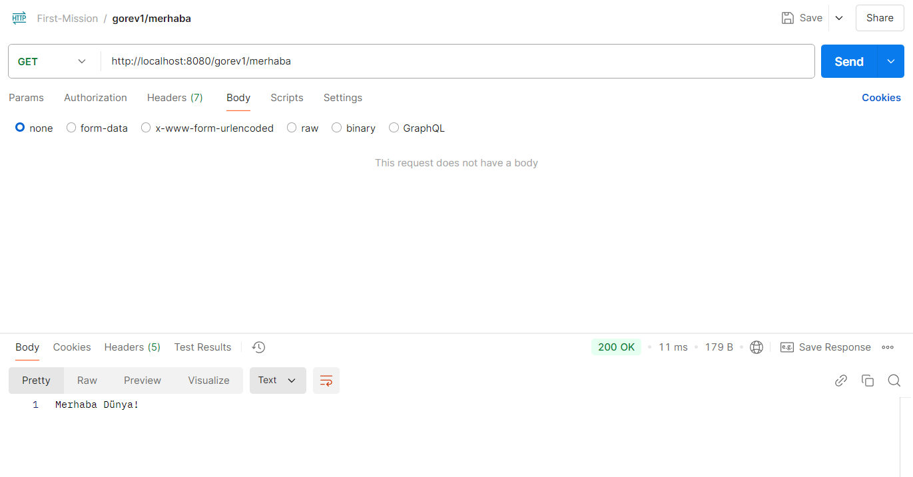

#### Post Request gorev1/merhaba
- parameter = türksat
  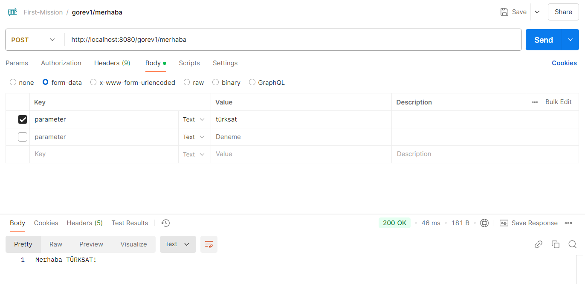

- parameter = Deneme
  

#### HTTP Kodları

- 400 Bad Request
  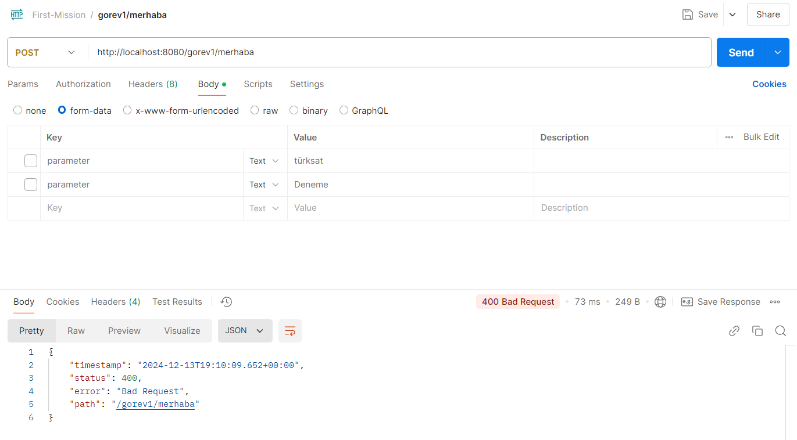

- 404 Not Found
  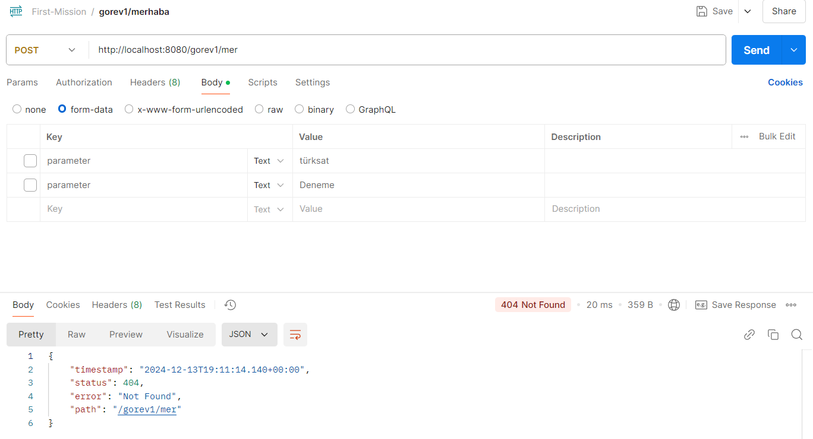

- 500 Internal Server Error
  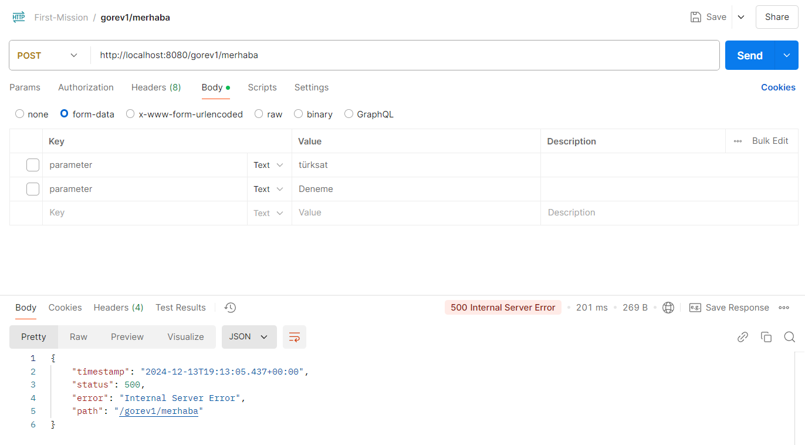

<hr/>

### Swagger Görüntüleri
#### API Description
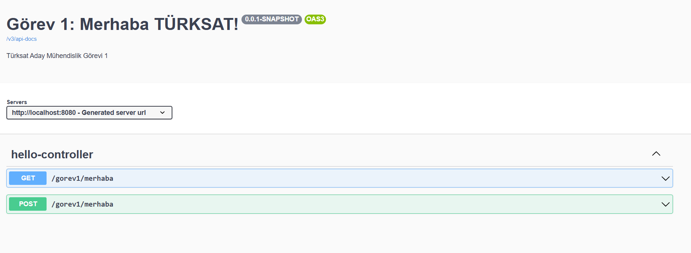

#### GET Endpoint
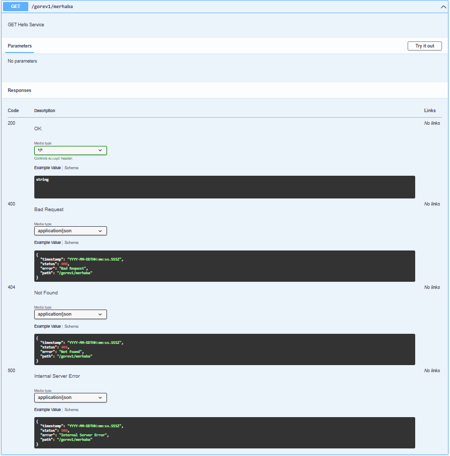

#### POST Endpoint
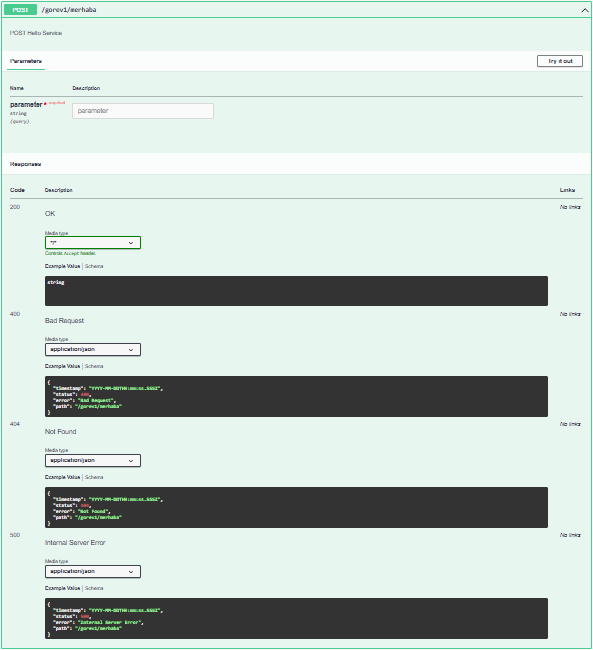

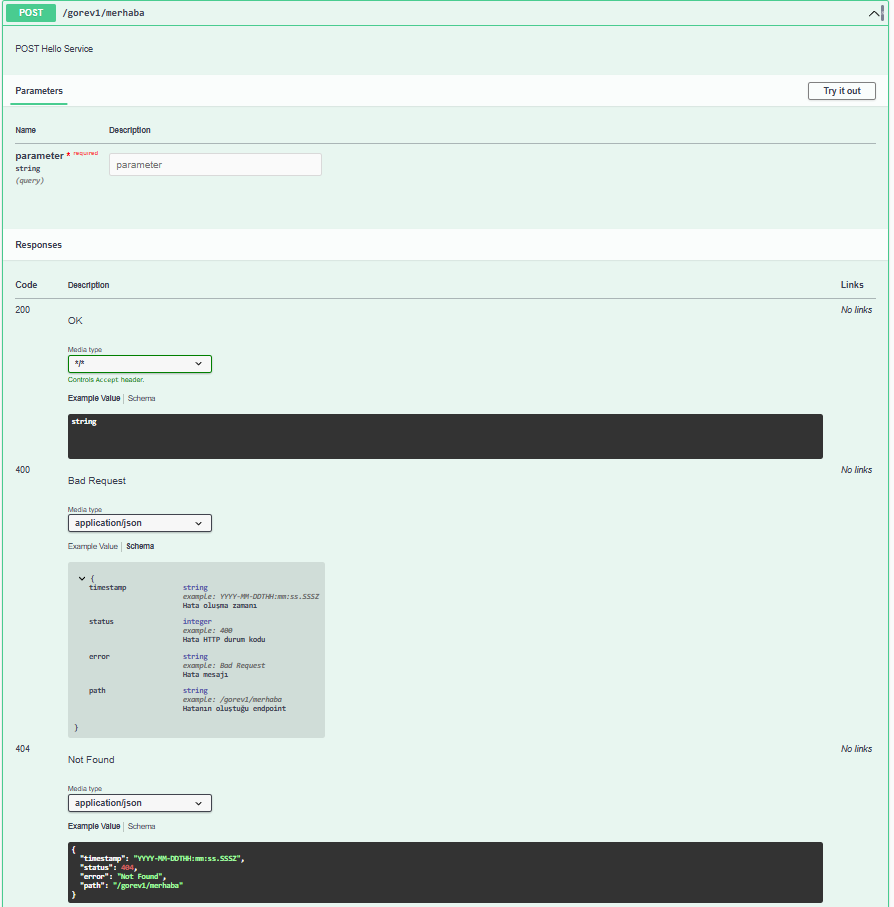

</details>


# Görev 2 : Basic Authentication

<details>
<summary><h3 style="display: inline-block">Detayları Görüntüle</h3></summary>

## Yapılacaklar:
- [x] Basic Authentication eklenmeli. Authentication bilgisi kullaniciAdi:şifre formatında olsun ve base64 encoded şekilde gönderilmeli.
  - kullaniciAdi testKullanici, şifre testSifre olacak şekilde ayarlayanabilir.

## Dökümantasyon

### Spring Security Nedir Ne İşe Yarar ?
Spring Security, Spring uygulamalarında kimlik doğrulama (giriş) ve yetkilendirme (erişim kontrolü) işlemlerini yöneten bir güvenlik çerçevesidir. Kullanıcıların sisteme giriş yapmasını sağlar ve hangi kullanıcıların hangi kaynaklara erişebileceğini kontrol eder, Örneğin 3. Kısım olan JWT ile rol tabanlı authentication bölümünde olduğu gibi.

### `SecurityConfig` Sınıfı

```java 

@EnableWebSecurity
public class SecurityConfig extends WebSecurityConfigurerAdapter {

    @Override
    protected void configure(HttpSecurity http) throws Exception {
        http.csrf().disable().authorizeRequests()
                .antMatchers("/gorev1/**").authenticated() // /gorev1 rotasına sadece doğrulama yapmış kullanıcılar erişebilir
                .anyRequest().permitAll() // belirlediğimiz rota dışındakiler için doğrulama istemez
                .and()
                .formLogin()
                .failureHandler((request, response, exception) -> {
                    // Hatalı giriş durumunda özel mesaj
                    response.setStatus(HttpServletResponse.SC_UNAUTHORIZED);
                    response.getWriter().write("KULLANICI ADI VEYA SIFRE HATALI");
                    response.getWriter().flush();
                })
                .and()

                .httpBasic(); // Base64 HTTP Basic Authentication ekliyoruz
    }
}

```

Bu sınıf, Spring Security ile güvenlik yapılandırmasını sağlar. `WebSecurityConfigurerAdapter` sınıfını extend eder ve HTTP güvenlik ayarlarını özelleştirir.

#### Anotasyonlar:
- **@EnableWebSecurity**: Bu anotasyon, Spring Security'yi etkinleştirir ve güvenlik yapılandırmasını sağlar.

#### Yapılandırmalar:
1. **`configure(HttpSecurity http)` Metodu**
    - Bu metod, HTTP güvenlik ayarlarını özelleştirir.

    - **`http.csrf().disable()`**: CSRF (Cross-Site Request Forgery) korumasını devre dışı bırakır. Genellikle API'ler için devre dışı bırakılır.

    - **`authorizeRequests()`**: İsteklere güvenlik kontrolleri ekler.
        - **`.antMatchers("/gorev1/**").authenticated()`**: `/gorev1/**` yolundaki isteklerin sadece doğrulama yapılmış kullanıcılar tarafından yapılabilmesini sağlar.
        - **`.anyRequest().permitAll()`**: Diğer tüm isteklere erişimi serbest bırakır, yani doğrulama gerektirmez.

    - **`formLogin()`**: Form tabanlı giriş yapılandırmasını sağlar.
        - **`failureHandler()`**: Hatalı giriş durumunda özel bir mesaj döndürür. Yanıt olarak "KULLANICI ADI VEYA SIFRE HATALI" mesajı ve 401 Unauthorized hatası gönderilir.

    - **`httpBasic()`**: HTTP Basic Authentication'ı etkinleştirir. Kullanıcı adı ve şifre base64 formatında gönderilir.

---

### `UserConfig` Sınıfı

Bu sınıf, Spring Security için kullanıcı yapılandırmasını sağlar. Kullanıcıları bellek üzerinde tanımlar ve şifreleri güvenli bir şekilde saklar.

```java 
@Configuration
public class UserConfig {

    @Bean
    protected UserDetailsService userDetailsService() {
        // Kullanıcı adı ve şifreyi bellek üzerinden tanımlıyoruz. Spring Security ilk aşamada burayı kontrol edecek
        return new InMemoryUserDetailsManager(
                User.withUsername("testKullanici")
                        .password(passwordEncoder().encode("testSifre")) //
                        .roles("USER")
                        .build()
        );
    }

    @Bean
    public PasswordEncoder passwordEncoder() {
        return new BCryptPasswordEncoder();
    }
}
```

#### Anotasyonlar:
- **@Configuration**: Spring’e bu sınıfın bir yapılandırma sınıfı olduğunu belirtir.

#### Yapılandırmalar:
1. **`userDetailsService()` Metodu**:
    - Bu metod, kullanıcı bilgilerini bellek üzerinde saklar.
    - **InMemoryUserDetailsManager** kullanarak, kullanıcı adı ve şifreyi tanımlar.
    - Kullanıcı adı **"testKullanici"** ve şifre **"testSifre"** ile tanımlanır. Şifre, **BCryptPasswordEncoder** ile şifrelenir.
    - Kullanıcıya **"USER"** rolü atanır.

2. **`passwordEncoder()` Metodu**:
    - Şifreleri güvenli bir şekilde saklamak için **BCryptPasswordEncoder** kullanılır. Aynı zamanda bu metot User.withUsername("testKullanici") ile oluşturduğumuz kullanıcımızın şifresi encode etmek için kullanılır.


## Uygulama Görüntüleri

### Konsol Görüntüsü


### Postman Görüntüleri

#### Get Request gorev1/merhaba
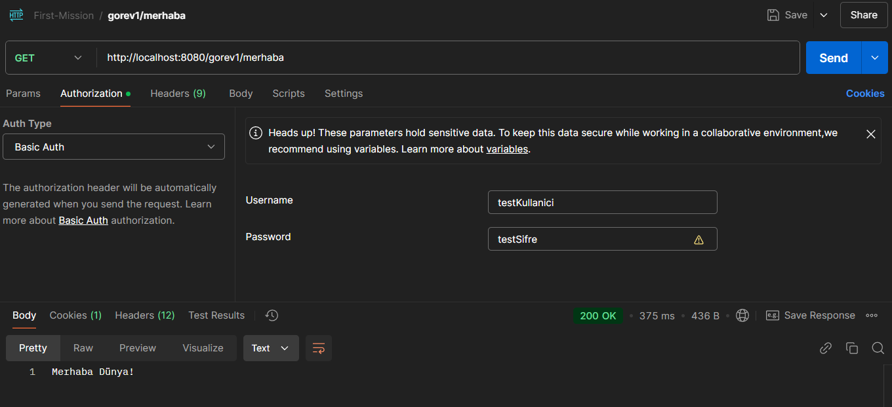

#### Post Request gorev1/merhaba
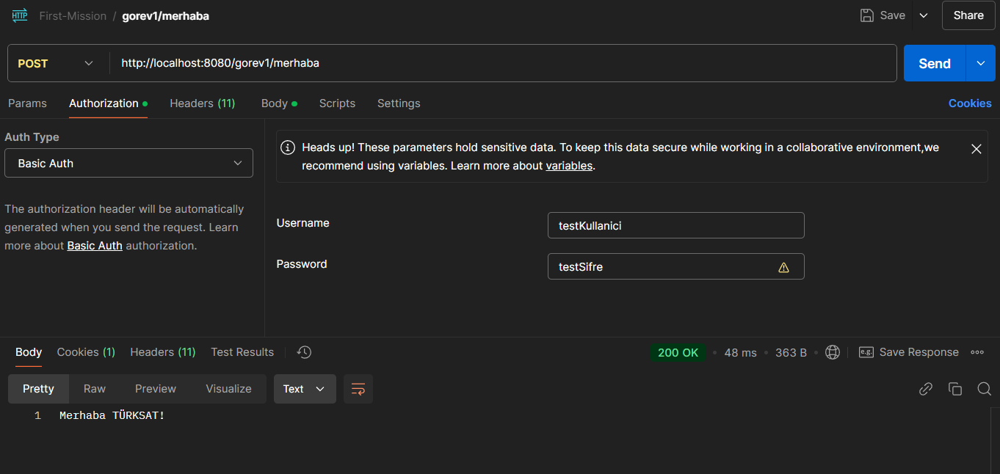

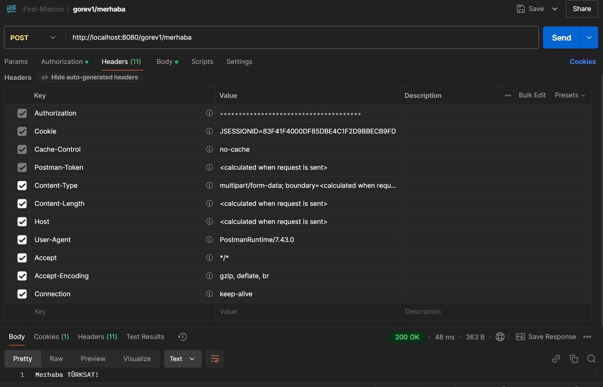

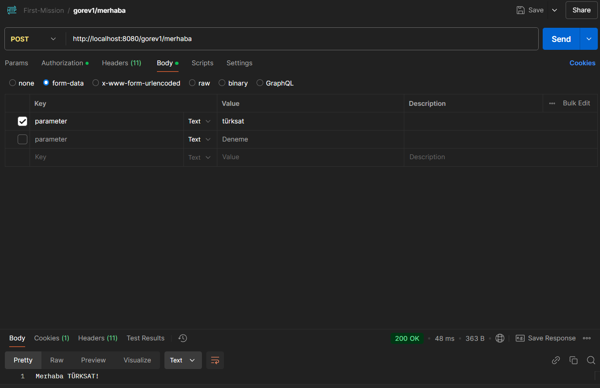

#### Login Ekranı Başarılı Giriş Get gorev1/merhaba
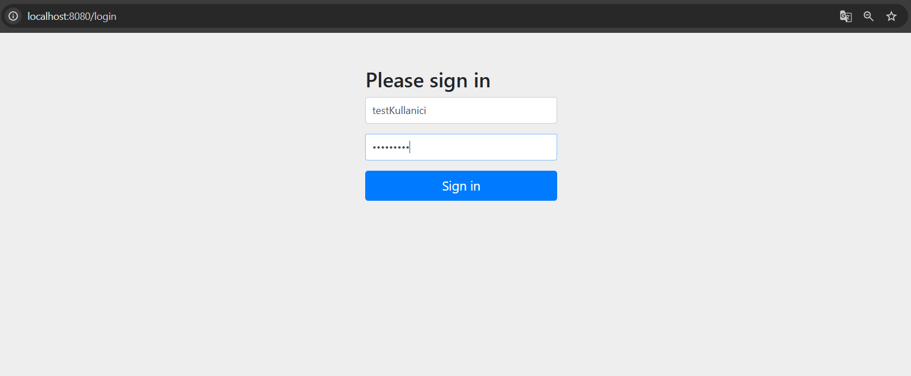

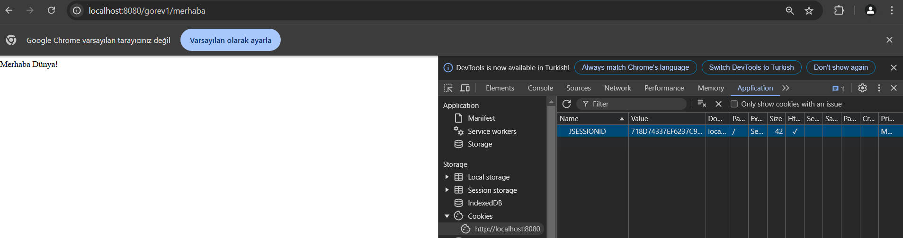

#### Login Ekranı Başarısız (Hatalı Kullanıcı) Giriş Get gorev1/merhaba
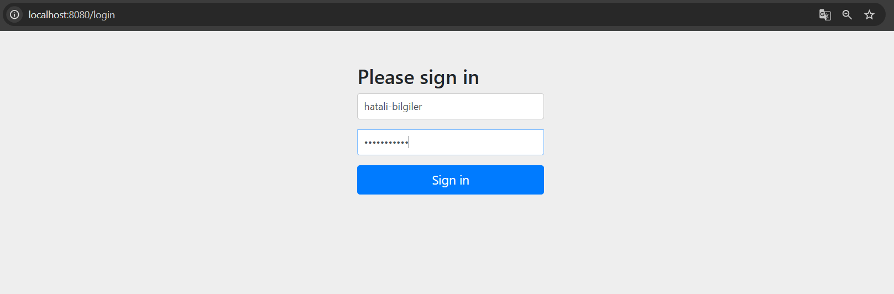

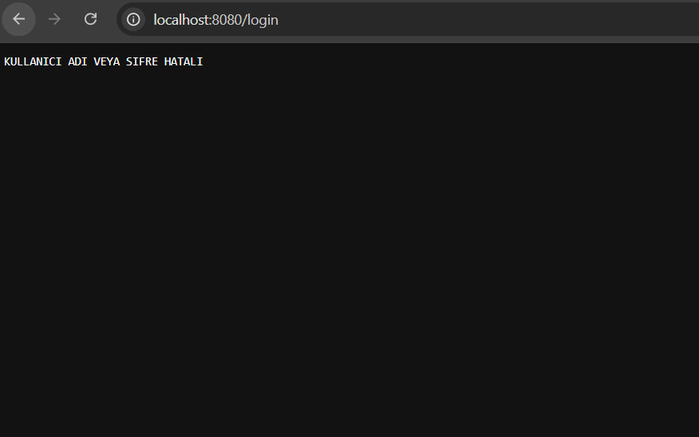


</details>

# Görev 3 : JWT ile Role Tabanlı Authentication

<details>
<summary><h3 style="display: inline-block">Detayları Görüntüle</h3></summary>

## Yapılacaklar:
- [x] Basic Authentication güvenlik konusunda yeterli değildir. Bu yüzden projeye sektörde de yaygın kullanılan JWT authentication eklenmeli.
- [x] PostgreSql veri tabanı kullanılarak uygulamaya veri tabanı bağlantısı sağlanmalı.
- [x] Örnek kayıtlar eklenmeli.

## Dökümantasyon

## Uygulama Görüntüleri

### Konsol Görüntüsü

### Postman Görüntüleri

### Swagger Görüntüleri


</details>